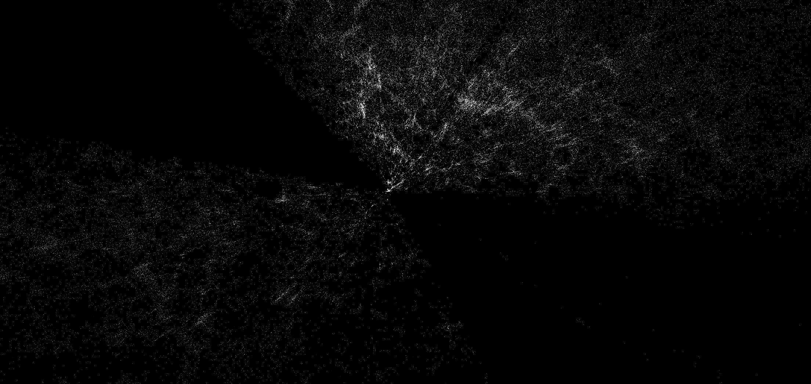

# Downloading data

You can download csv from [this site](https://skyserver.sdss.org/dr12/en/tools/search/sql.aspx).using this query.

```
SELECT TOP 500000
 p.objid,p.ra,p.dec, p.modelMag_u, p.modelMag_g, p.modelMag_r, p.modelMag_i, p.modelMag_z, p.fiberMag_u, p.fiberMag_g, p.fiberMag_r, p.fiberMag_i, p.fiberMag_z, p.petroR50_r, p.petroR50_z, p.petroR90_r, p.petroR90_z, p.r, p.i, p.z, s.z as redshift 
FROM PhotoObj AS p
   JOIN SpecObj AS s ON s.bestobjid = p.objid
WHERE
   s.class='GALAXY' OR s.class='QSO'
```

*note* one can download only 5lakh datapoints at a time.

# To merge multiple downloaded data

run the `merge-script.sh` (note for windows users, must have WSL or git-bash) usage-

```bash
bash merge-script.sh
OR
./merge-script.sh
```

This will merge all the `.csv` files and remove redundancies and create a file `sorted.csv`

# Running python script

- `pip install -r requirements.txt` 

- Run the `final.py` to view the interactive graph.

    

